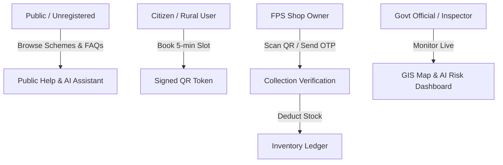

# Smart Ration (Ration Mitra / राशन मित्र) 🌾

[](https://github.com/DIPESHCHOUHAN91466/smart-ration-appp)
[](frontend/README.md)
[-512BD4?logo=dotnet)](backend/SmartRation.Api/README.md)
[](backend/SmartRation.Python/README.md)
[](database/README.md)
[](mobile/README.md)
[](tests/README.md)

A modern, transparent, and resilient digital **Public Distribution System (PDS)** for India. **Smart Ration** eliminates long queues at Fair Price Shops (FPS) through scheduled slot reservations, cryptographically signed offline-verifiable QR tokens, real-time stock ledgering, predictive supply chain analytics, and a multilingual AI assistant (**Ration Mitra**).

Supported Languages: **English**, **हिंदी (Hindi)**, and **मराठी (Marathi)**.

> [!NOTE]
> **Demonstration System & Data Guard**: All citizen profiles, households, passbooks, Aadhaar references, and ration card quotas in this repository are **synthetic** (`DATA_MODE=synthetic`). The system contains built-in guards that safely refuse to start in `DATA_MODE=real` until certified government API gateways (UIDAI eKYC, State PDS portals) are configured.

---

## Table of Contents

- [Key Highlights & Problems Solved](#key-highlights--problems-solved)
- [User Personas & Capabilities](#user-personas--capabilities)
- [How It Works (End-to-End Workflow)](#how-it-works-end-to-end-workflow)
- [System Architecture (Frozen Hybrid)](#system-architecture-frozen-hybrid)
- [Technology Stack](#technology-stack)
- [Repository Structure](#repository-structure)
- [Security & Cryptography](#security--cryptography)
- [AI Analytics & Public Help Chatbot](#ai-analytics--public-help-chatbot)
- [Quick Start & Setup](#quick-start--setup)
- [Default Demo Accounts](#default-demo-accounts)
- [Developer CLI (`sr.ps1`)](#developer-cli-srps1)
- [Testing Strategy](#testing-strategy)
- [API Documentation](#api-documentation)
- [Docker & Deployment](#docker--deployment)
- [Project Documentation Links](#project-documentation-links)

---

## Key Highlights & Problems Solved

| Traditional PDS Challenge | Smart Ration Solution |
|---|---|
| **Overcrowding & Long Waiting Times** | Citizens book a **5-minute time slot** at their designated Fair Price Shop. |
| **Tampering & Ration Card Fraud** | Time-limited **HMAC-SHA256 digitally signed QR tokens**; zero PII stored inside the QR code. |
| **Network Blackouts at Rural Shops** | Offline QR verification supported with secure local caching, backed by **SMS OTP fallback**. |
| **Stock Leakages & Ghost Beneficiaries** | Transactional, **idempotent collection ledger** with optimistic concurrency control. |
| **Information Barriers & Low Literacy** | Full trilingual UI (English, Hindi, Marathi) with voice-ready text and a **safe AI Chatbot (Ration Mitra)**. |
| **Last-Minute Stockouts** | Python AI analytics service predicting **stock depletion risks**, demand spikes, and distribution anomalies. |

---

## User Personas & Capabilities



### 1. Public Visitor (No Login Required)
- Access transparent information on government schemes (Antyodaya Anna Yojana - AAY, Priority Household - PHH).
- Interactive **Scheme Eligibility Calculator**.
- Searchable Public Knowledge Base articles in English, Hindi, and Marathi.
- Interactive **Ration Mitra AI Chatbot** for general guidance.

### 2. Citizen / Beneficiary (Rural User)
- Authenticated citizen portal with family member details and monthly ration card entitlement balance.
- 5-minute time slot booking at their assigned local Fair Price Shop.
- Generation of a digitally signed QR token (`SRQR-{tokenId}-{signature}`).
- Token collection history, active passbook verification, and instant SMS status alerts.

### 3. Fair Price Shop (FPS) Operator
- Today's appointment queue and real-time operational dashboard.
- High-speed camera QR scanner via browser (`html5-qrcode`) or mobile app (`expo-camera`).
- Cryptographic HMAC signature validation.
- Fail-safe **SMS OTP verification** (6-digit, 5-minute expiry, 3-attempt limit) if the beneficiary's phone screen is damaged.
- Real-time stock issuance and automated stock ledger deductions.

### 4. Government Official & District Admin
- Live district/taluka GIS map tracking Fair Price Shop activity.
- Real-time distribution progress vs. monthly quotas.
- AI-driven stockout alerts (warning when buffer falls below 14-day threshold).
- Anomaly and fraud detection flags (unusual booking spikes, off-hours collections).
- Full audit trails and read-only administrative database viewer.

---

## How It Works (End-to-End Workflow)

1. **Beneficiary Registration & Entitlement**: The citizen registers or is seeded into a household. The system calculates monthly entitlement based on the assigned scheme:
   $$\text{Available Quota} = (\text{Scheme Quota} \times \text{Eligible Family Members}) - \text{Collected This Month}$$
2. **Slot Reservation**: The citizen selects a convenient 5-minute window for their assigned Fair Price Shop.
3. **Token Issuance**: The server generates a unique Token record and computes an HMAC-SHA256 signature containing token ID, shop code, slot window, and items.
4. **Shop Verification**:
   - The shopkeeper scans the QR code.
   - The server verifies the signature, shop tenancy, and slot validity.
   - Only masked beneficiary data (e.g., `XXXX-XXXX-1234`) and eligible item quantities are displayed to the shopkeeper.
   - *Fallback*: If camera scanning fails, the shopkeeper clicks "Send OTP" to transmit a 6-digit code to the registered mobile.
5. **Idempotent Collection**: When items are handed over, the transaction completes atomically:
   - The token status is marked `Collected`.
   - Inventory is decremented using optimistic concurrency (`UPDATE Inventory SET AvailableQuantity = ... WHERE AvailableQuantity = @readVal`).
   - An immutable record is created in `InventoryMovements` and `RationCollections`.

---

## System Architecture (Frozen Hybrid)

Smart Ration adopts a **frozen hybrid architecture**: ASP.NET Core 8 powers high-performance transactional business rules and inventory ledgers; Python FastAPI serves as the intelligent API gateway, authentication authority, and AI analytics engine.

```
                         User (Browser / Mobile App)
                                    │
                                    ▼
                         Frontend (React 18 + Vite, :5173)
                                    │  All API calls
                                    ▼
                Python API Gateway (FastAPI, :8000)
                ├── Authentication (Argon2id, JWT, Refresh Tokens)
                ├── Public Help & Ration Mitra AI Chatbot
                ├── Health & Readiness Probes (/health, /ready)
                └── Reverse Proxy (Forwards business routes)
                         │
                         ├───────────────────────────────────┐
                         │                                   ▼
                         │                      Core Business API (ASP.NET Core 8, :5188)
                         │                      ├── Slot Management & Allocation
                         │                      ├── Token Issuance & HMAC QR Verification
                         │                      ├── OTP Generation & Fallback Service
                         │                      ├── Idempotent Collection & Inventory Ledger
                         │                      └── Admin & Beneficiary Profiles
                         │                                   │
                         │                                   ▼ HTTP (Internal)
                         │                      AI Analytics Service (FastAPI, :8001)
                         │                      ├── 14-Day Demand & Stockout Forecasting
                         │                      ├── Anomaly Detection & Fraud Scoring
                         │                      └── Document OCR (Optional)
                         │                                   │
                         ▼                                   ▼ (Read-Only)
                    MySQL 8 Database (`smartration` / 25 Tables)
```

---

## Technology Stack

| Layer | Technologies |
|---|---|
| **Frontend Web** | React 18, Vite 6, React Router 7, Zustand, Axios, Leaflet / React-Leaflet, html5-qrcode, Lucide Icons, Vitest |
| **Mobile App** | React Native 0.86, Expo SDK 57, Expo Router, Expo Camera, Expo SQLite, Expo SecureStore |
| **API Gateway** | Python 3.11+, FastAPI, Pydantic v2, SQLAlchemy 2, Alembic, httpx, Argon2-cffi, PyJWT |
| **Core Business API** | .NET 8 (C#), ASP.NET Core Web API, Entity Framework Core 8, Pomelo MySQL Provider |
| **AI & Analytics** | Python 3.11+, FastAPI, NumPy, Pandas, scikit-learn |
| **Database** | MySQL 8.0 (`InnoDB`, `utf8mb4_0900_ai_ci`), Alembic Migrations |
| **Testing & Quality** | xUnit, Moq, FluentAssertions, pytest, Vitest, Playwright, Ruff, mypy, ESLint |
| **Deployment** | Docker, Docker Compose, Nginx, PowerShell Automation |

---

## Repository Structure

```
Smart_Ration_HSD2C_Final/
├── frontend/                     # React 18 web application              → frontend/README.md
│   ├── src/components/           # Reusable UI & Chatbot widget          → frontend/src/components/README.md
│   ├── src/pages/                # Role dashboards (Citizen, Shop, Admin)→ frontend/src/pages/README.md
│   ├── src/services/             # Axios API client modules              → frontend/src/services/README.md
│   ├── src/store/                # Zustand global authentication state   → frontend/src/store/README.md
│   ├── src/i18n/                 # English, Hindi, and Marathi locales   → frontend/src/i18n/README.md
│   ├── tests/                    # Vitest unit & component tests         → frontend/tests/README.md
│   └── e2e/                      # Playwright end-to-end browser tests   → frontend/e2e/README.md
├── backend/                      # Backend microservices & tests         → backend/README.md
│   ├── SmartRation.Api/          # C# ASP.NET Core business API (:5188)  → backend/SmartRation.Api/README.md
│   ├── SmartRation.Api.Tests/    # C# xUnit test suite (104 tests)       → backend/SmartRation.Api.Tests/README.md
│   ├── SmartRation.Python/       # Python FastAPI Gateway & Auth (:8000) → backend/SmartRation.Python/README.md
│   │   ├── app/chatbot/          # Modular chatbot intent & engine
│   │   ├── app/synthetic/        # Synthetic data generation engine
│   │   └── tests/                # Python unit, contract & scale tests   → backend/SmartRation.Python/tests/README.md
│   └── SmartRation.AI/           # Python AI Analytics Service (:8001)   → backend/SmartRation.AI/README.md
├── mobile/                       # Expo / React Native mobile client     → mobile/README.md
├── database/                     # MySQL schema, setup & backups         → database/README.md
│   └── mysql/                    # Backup and restore utilities          → database/mysql/README.md
├── ai/                           # Chatbot knowledge base & evaluations  → ai/README.md
├── data/                         # Synthetic demo datasets & rules       → data/README.md
│   ├── synthetic/                # 1000+ realistic synthetic records    → data/synthetic/README.md
│   └── real/                     # Integration requirements for live PDS → data/real/README.md
├── tests/                        # Cross-cutting integration tests       → tests/README.md
│   └── mysql/                    # Direct live MySQL test suite          → tests/mysql/README.md
├── scripts/                      # Developer automation scripts          → scripts/README.md
├── docs/                         # Architecture, API & security specs    → docs/README.md
├── deployment/                   # Docker Compose & Nginx configurations → deployment/README.md
├── sr.ps1                        # Unified developer CLI tool
└── docker-compose.yml            # Multi-container orchestration
```

---

## Security & Cryptography

- **Password Protection**: Modern **Argon2id** password hashing. Legacy BCrypt hashes are transparently verified and automatically upgraded on subsequent logins.
- **Interchangeable JWT Authentication**: 15-minute cryptographically signed JWTs shared between the Python Gateway and the C# API using standard HMAC-SHA256 with identical issuer, audience, and secret keys.
- **Rotating Refresh Tokens**: 7-day refresh tokens stored as one-way SHA-256 hashes in MySQL, rotated upon every refresh cycle.
- **Tamper-Proof QR Tokens**:
  - Format: `SRQR-{tokenId}-{base64url(HMAC-SHA256(secret, payload))}`
  - The QR contains **no personally identifiable information (PII)**.
  - The QR signature expires at the end of the scheduled time slot.
- **Masked Data Governance**: Beneficiary Aadhaar numbers are never transmitted in plaintext (`XXXX-XXXX-1234`).
- **Data Mode Barrier**: If `DATA_MODE=real` is specified, backends will cleanly halt at startup with an explanatory message until certified UIDAI/PDS endpoints are linked.

---

## AI Analytics & Public Help Chatbot

### Ration Mitra (AI Assistant)
- Located on every page (bottom-right widget) and in Public Help.
- Works across English, Hindi, and Marathi.
- **Safety Filters First**:
  - Rejects queries containing 12-digit Aadhaar patterns or 6-digit OTP codes.
  - Prevents prompt injection and requests for internal source code or databases.
  - Limits authenticated citizens to querying only their *own* active bookings.
  - Enforces general healthcare and nutrition boundaries.
- **Knowledge Retrieval Engine**: Grounded in human-reviewed government guidelines stored in `ai/chatbot/knowledge/`.

### Predictive Analytics Engine (:8001)
- **Stockout Risk Modeling**: Calculates buffer depletion rates and flags shops with under 14 days of remaining inventory.
- **Queue & Demand Forecasting**: Analyzes historical slot bookings to recommend optimal staffing hours for shop owners.
- **Anomaly Detection**: Flags anomalous collection volumes exceeding standard family quota thresholds.

---

## Quick Start & Setup

### Prerequisites
- [.NET 8.0 SDK](https://dotnet.microsoft.com/download/dotnet/8.0)
- [Python 3.11+](https://www.python.org/downloads/)
- [Node.js 18+ and npm](https://nodejs.org/)
- [MySQL 8.0+](https://dev.mysql.com/downloads/mysql/) (running on localhost:3306)

### One-Command Setup

Run the developer CLI script from PowerShell:
```powershell
# 1. Automatic environment setup (virtual environments, npm install, dotnet restore, .env files)
.\sr.ps1 setup

# 2. Start all 4 services concurrently in separate windows
.\sr.ps1 run
```

Access the applications:
- **Frontend Dashboard**: [http://localhost:5173](http://localhost:5173)
- **Python Gateway (Docs)**: [http://127.0.0.1:8000/docs](http://127.0.0.1:8000/docs)
- **C# Business API (Swagger)**: [http://localhost:5188/swagger](http://localhost:5188/swagger)
- **AI Analytics Service**: [http://127.0.0.1:8001/docs](http://127.0.0.1:8001/docs)

---

## Default Demo Accounts

When running in development or demo mode (`VITE_DEMO_MODE=true`), quick-login buttons are available on the login page:

| Persona | Email | Password | Role | Description |
|---|---|---|---|---|
| **Citizen (Rural User)** | `rural@example.com` | `demo123` | `RuralUser` | Book slots, view family entitlements, view QR token |
| **Fair Price Shop Owner** | `shop@example.com` | `demo123` | `ShopOwner` | Scan QR tokens, verify OTPs, manage shop stock |
| **Government Official** | `officer@example.com` | `demo123` | `GovernmentOfficial` | Inspect district map, view stock alerts, view AI insights |
| **System Admin** | `admin@example.com` | `admin123` | `Admin` | Full administrative database inspection & user management |

---

## Developer CLI (`sr.ps1`)

The repository includes a unified developer command line interface in the root directory:

```powershell
.\sr.ps1 help                         # Display CLI help
.\sr.ps1 setup                        # Setup venvs, install packages, prepare .env files
.\sr.ps1 run                          # Launch all 4 services in parallel
.\sr.ps1 stop                         # Terminate all running service processes
.\sr.ps1 health                       # Perform diagnostic health checks on tools, services & DB
.\sr.ps1 test                         # Run all unit and API tests
.\sr.ps1 test -MySql                  # Run all tests including live MySQL scale suite
.\sr.ps1 e2e                          # Run Playwright end-to-end browser tests
.\sr.ps1 build                        # Compile .NET, build Vite bundle, check Python imports
.\sr.ps1 lint                         # Execute Ruff, mypy, and ESLint
.\sr.ps1 db verify                    # Verify MySQL connection and schema state
.\sr.ps1 db seed                      # Seed reference and demo data into empty tables
.\sr.ps1 synthetic --users 1000       # Generate 1000 synthetic citizen records & bookings
```

---

## Testing Strategy

Smart Ration enforces high test coverage across all layers:

```
                            Testing Pyramid
                               ┌───────┐
                               │  E2E  │ Playwright (Smoke & Mobile Viewports)
                            ┌──┴───────┴──┐
                            │ Contract/Live│ Proxy Parity & MySQL Suite (1000 records)
                         ┌──┴──────────────┴──┐
                         │    Unit & Component │ xUnit (104), pytest (248), Vitest (39)
                         └─────────────────────┘
```

| Component | Framework | Count | Command |
|---|---|---|---|
| **C# Business API** | xUnit, Moq | **104** | `dotnet test SmartRation.sln -c Release` |
| **Python Gateway** | pytest | **248** | `backend\SmartRation.Python\.venv\Scripts\pytest` |
| **Frontend Web** | Vitest, Testing Library | **39** | `cd frontend && npm test` |
| **End-to-End** | Playwright | **Smoke Suite** | `cd frontend && npm run test:e2e` |
| **Direct MySQL** | pytest, SQLAlchemy | **145** | `.\sr.ps1 test -MySql` |

---

## API Documentation

- **Python API Gateway**: Interactive Swagger docs at `http://127.0.0.1:8000/docs`
  - `/api/auth/register`, `/api/auth/login`, `/api/auth/refresh`, `/api/auth/logout`
  - `/api/public-help/categories`, `/api/public-help/topics`
  - `/api/chatbot/message`, `/api/chatbot/feedback`
  - `/health`, `/health/live`, `/ready`
- **C# Business API**: Swagger UI at `http://localhost:5188/swagger`
  - `/api/timeslots`, `/api/timeslots/available`
  - `/api/tokens/book`, `/api/tokens/my-tokens`, `/api/tokens/verify-qr`
  - `/api/collections/record`, `/api/collections/otp/send`, `/api/collections/otp/verify`
  - `/api/inventory`, `/api/inventory/movements`
  - `/api/beneficiaries/me`, `/api/beneficiaries/family`
  - `/api/admin/database/tables`, `/api/admin/reports`
- **Static OpenAPI Specifications**: Exported contracts live in [`api/openapi/`](api/openapi/).

---

## Docker & Deployment

A complete containerized stack is available via Docker Compose:

```bash
# Build and run the entire stack
docker-compose up --build -d

# Verify running containers
docker-compose ps
```

The stack runs:
- `smartration-db`: MySQL 8.0 container on port `3306`
- `smartration-python`: Python FastAPI Gateway on port `8000`
- `smartration-csharp`: C# ASP.NET Core API on port `5188`
- `smartration-ai`: AI Analytics Service on port `8001`
- `smartration-frontend`: Nginx serving the React SPA bundle on port `80` / `5173`

Production deployment guides and Nginx reverse proxy configs are in [docs/deployment/DEPLOYMENT.md](docs/deployment/DEPLOYMENT.md).

---

## Project Documentation Links

- 🏛️ **System Architecture**: [docs/architecture/SYSTEM_ARCHITECTURE.md](docs/architecture/SYSTEM_ARCHITECTURE.md)
- 🔌 **API Architecture & Contracts**: [docs/api/API.md](docs/api/API.md)
- 💾 **Database Architecture & Schema**: [docs/database/DATABASE_ARCHITECTURE.md](docs/database/DATABASE_ARCHITECTURE.md)
- 🔒 **Security & Cryptography Design**: [docs/security/SECURITY_ARCHITECTURE.md](docs/security/SECURITY_ARCHITECTURE.md)
- 🤖 **Chatbot & AI Architecture**: [docs/chatbot/CHATBOT_ARCHITECTURE.md](docs/chatbot/CHATBOT_ARCHITECTURE.md)
- 📊 **Synthetic Data Generation**: [docs/architecture/DATA_ARCHITECTURE.md](docs/architecture/DATA_ARCHITECTURE.md)
- 🧪 **Testing Guidelines**: [docs/testing/TESTING.md](docs/testing/TESTING.md)
- 🚀 **Local Setup Guide**: [docs/development/LOCAL_SETUP.md](docs/development/LOCAL_SETUP.md)
- 📋 **Project Status & Audit**: [docs/PROJECT_STATUS.md](docs/PROJECT_STATUS.md)
- 🤝 **Contributing**: [CONTRIBUTING.md](CONTRIBUTING.md)
- 🛡️ **Security Policy**: [SECURITY.md](SECURITY.md)
- 📜 **Changelog**: [CHANGELOG.md](CHANGELOG.md)
