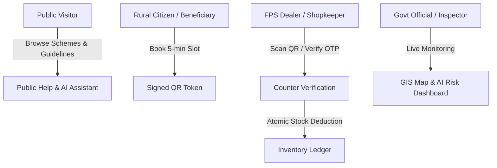

# Smart Ration (Ration Mitra / राशन मित्र) 🌾🇮🇳

[](https://github.com/DIPESHCHOUHAN91466/smart-ration-appp)
[](backend/SmartRation/README.md)
[](frontend/README.md)
[](smart_ration_mobile/README.md)
[-4479A1?logo=mysql)](database/README.md)
[](docs/deployment/AZURE_AND_PLAYSTORE_DEPLOYMENT_GUIDE.md)
[](smart_ration_mobile/RELEASE.md)
[](COMPLIANCE_CHECKLIST.md)

A next-generation, transparent, and resilient digital **Public Distribution System (PDS)** for India. **Smart Ration** modernizes grain distribution by eliminating overcrowded queues at Fair Price Shops (FPS) through scheduled slot reservations, cryptographically signed offline-verifiable QR tokens, real-time stock ledgering, predictive supply chain analytics, and a multilingual voice-assisted AI companion (**Ration Mitra**).

Supported Languages: **English**, **हिंदी (Hindi)**, and **मराठी (Marathi)**.

> [!NOTE]
> **Data Protection & Synthetic Barrier**: All citizen households, ration card quotas, Aadhaar references, and transactions in this repository are **synthetic** (`DATA_MODE=synthetic`). The system contains hard startup barriers that refuse to boot in `DATA_MODE=real` until certified government gateways (UIDAI eKYC, State PDS, DLT-registered SMS) are securely integrated.

---

## Table of Contents

- [Key Highlights & Problems Solved](#key-highlights--problems-solved)
- [System Architecture](#system-architecture)
- [User Personas & Capabilities](#user-personas--capabilities)
- [End-to-End Workflow](#end-to-end-workflow)
- [Technology Stack](#technology-stack)
- [Repository Structure](#repository-structure)
- [Security, Privacy & DPDP Act 2023](#security-privacy--dpdp-act-2023)
- [AI Subsystem & Ration Mitra Assistant](#ai-subsystem--ration-mitra-assistant)
- [Quick Start & Local Setup](#quick-start--local-setup)
- [Configuration & Environment Variables](#configuration--environment-variables)
- [Default Demo Credentials](#default-demo-credentials)
- [Developer CLI (`sr.ps1`)](#developer-cli-srps1)
- [Testing & Quality Assurance](#testing--quality-assurance)
- [Azure Cloud & Play Store 5-Phase Deployment](#azure-cloud--play-store-5-phase-deployment)
- [Documentation Directory](#documentation-directory)

---

## Key Highlights & Problems Solved

| Traditional PDS Challenge | Smart Ration Solution |
|---|---|
| **Overcrowding & Long Lines** | Citizens book a guaranteed **5-minute time slot** at their designated Fair Price Shop via Web or Android App. |
| **Ration Card Fraud & Tampering** | Time-limited **HMAC-SHA256 digitally signed QR tokens** (`SRQR-{tokenId}-{sig}`) with zero PII stored inside the QR code. |
| **Rural Connectivity Dropouts** | Cached offline QR token display in the Flutter mobile app; server-side verification with **SMS OTP fallback** when scanning fails. |
| **Stock Leakage & Ghost Beneficiaries** | Transactional, **idempotent collection ledger** with optimistic concurrency controls and atomic stock decrements. |
| **Illiteracy & Language Barriers** | Trilingual user interfaces (English, Hindi, Marathi) with **Speech-to-Text** voice commands and **Text-to-Speech (TTS)** narration. |
| **Stockouts & Supply Bottlenecks** | Python AI predictive analytics modeling **stockout risk horizons**, queue bottlenecks, and fraudulent distribution spikes. |
| **Data Privacy & Legal Compliance** | Full **DPDP Act 2023** compliance: single-click "Download My Data" JSON export and verifiable consent logs at signup. |

---

## System Architecture

```
                       [Clients]
         ┌───────────────────────────────────┐
         │                                   │
         ▼                                   ▼
Android App (Flutter)              Web Portal (React 18 + Vite)
smart_ration_mobile/               frontend/ (built into backend image)
         │                                   │
         └─────────────────┬─────────────────┘
                           │ HTTPS / JSON (JWT Bearer / Cookie)
                           ▼
          Backend API — backend/SmartRation (Python FastAPI)
          ├── Auth & Security (Argon2id, JWT, MFA/TOTP, Account Lockout)
          ├── Citizen Portal (Entitlements, Slot Booking, Signed QR)
          ├── FPS Counter (QR Scanner, OTP Verification, Stock Issue)
          ├── Inventory Ledger (Idempotent Deliveries & Write-Offs)
          ├── Grievance Redressal (Lodge, Track, Resolve)
          ├── Government Dashboard (GIS Map, Inspections, Stock Alerts)
          ├── DPDP Act 2023 ("Download My Data" Export, Consent Audits)
          ├── Public Help & Ration Mitra AI Assistant (Knowledge Retrieval)
          └── Static Web Server (Serves React Web App on Same Origin)
                           │
             ┌─────────────┴─────────────┐
             │ SQLAlchemy 2.0 (TLS)      │ Internal HTTP (API Key)
             ▼                           ▼
      MySQL 8.4 Flexible           AI Analytics Service (:8001)
      (Azure Flexible Server)      ai/ (Demand Forecasts, Stockout Risk,
      27 tables, Alembic 0001-0004      Queue Predictions, Anomaly Detection)
```

> **Historical Note**: The original C# .NET 8 API in `backend/SmartRation.Api` has been retired. Every business route, ledger operation, and cryptographic verification is natively handled by the Python FastAPI backend. The C# source is retained for historical and architectural reference.

---

## User Personas & Capabilities



### 1. Citizen / Beneficiary (Rural User)
- Authenticate via registered mobile + OTP or email + password.
- View ration card details, eligible family members, and monthly entitlement balance.
- Book 5-minute time slots at their assigned Fair Price Shop.
- Generate and display HMAC-SHA256 signed QR tokens (saved offline in Flutter Secure Storage).
- Ask the **Ration Mitra AI Assistant** questions via text or voice in English, Hindi, or Marathi.
- Lodge grievances with tracking IDs and monitor resolution status.
- Download a complete copy of personal records ("Download My Data" under DPDP Act 2023).

### 2. Fair Price Shop (FPS) Dealer
- Real-time queue view and appointment timetable for the day.
- High-speed camera QR code scanner (web camera or mobile camera).
- Real-time cryptographic signature and eligibility verification.
- SMS OTP fallback (6-digit, 5-minute expiry) for citizens with broken phone screens.
- Atomic grain distribution with digital receipt generation.
- Idempotent stock delivery acceptance and write-off logging.

### 3. Government Official & District Inspector
- Live GIS district map tracking shop distributions and activity.
- Real-time inventory status across all fair price shops.
- AI-driven stockout alerts (7-day predictive demand vs. physical stock).
- Fraud and anomaly detection (unusual collection spikes, off-hours activity).
- Review and resolve citizen grievances with automated SMS/in-app notifications.

### 4. Public Visitor (Unauthenticated)
- Transparent details on government food schemes (AAY, PHH).
- Searchable trilingual Public Knowledge Base articles.
- Ration Mitra AI Chatbot for scheme inquiries and FAQs.

---

## End-to-End Workflow

1. **Quota Calculation**:
   $$\text{Available Monthly Quota} = (\text{Scheme Quota per Person} \times \text{Family Members}) - \text{Collected This Month}$$
2. **Slot Reservation**: Citizen books an open 5-minute window for their FPS.
3. **Token Issuance**: The backend issues a unique token record and signs the payload with HMAC-SHA256 using `QR_SECRET`:
   $$\text{Signature} = \text{Base64Url}(\text{HMAC-SHA256}(\text{QR\_SECRET}, \text{Payload}))$$
4. **Verification at FPS**: The dealer scans the QR code. The server verifies signature validity, dealer tenancy, and time slot window. (No Aadhaar or PII is exposed in the QR code).
5. **Atomic Handover**: When grains are weighed and distributed, the transaction completes atomically:
   - Token marked as `Collected`.
   - Inventory decremented using optimistic concurrency (`WHERE AvailableQuantity >= requested`).
   - Immutable audit entries appended to `InventoryMovements` and `RationCollections`.

---

## Technology Stack

| Layer | Technologies | Primary Path |
|---|---|---|
| **Backend API** | Python 3.13 / FastAPI, SQLAlchemy 2.0, Alembic, Uvicorn, PyJWT, Argon2-cffi, Pydantic v2 | `backend/SmartRation` |
| **Web Frontend** | React 18, Vite 6, React Router 7, Zustand, Tailwind CSS, Leaflet, Vitest | `frontend/` |
| **Mobile App** | Flutter 3.24+ / Dart 3.5+, Riverpod, GoRouter, Dio, MobileScanner, Speech-to-Text, Flutter TTS, Flutter Secure Storage | `smart_ration_mobile/` |
| **Database** | MySQL 8.0 / 8.4 Flexible Server (`utf8mb4_unicode_ci`), 27 tables, Alembic revisions `0001`–`0004` | `database/`, `backend/SmartRation/migrations` |
| **AI Analytics** | Python FastAPI microservice, transparent statistical forecasting and anomaly detection | `ai/` |
| **Cloud Hosting** | Microsoft Azure (Azure Database for MySQL Flexible Server, Azure Container Apps / App Service) | `docs/deployment/AZURE_AND_PLAYSTORE_DEPLOYMENT_GUIDE.md` |
| **Distribution** | Google Play Store (Release AAB with R8 shrinking & Play App Signing) | `smart_ration_mobile/RELEASE.md` |

---

## Repository Structure

```
smart-ration-appp/
├── .github/workflows/         # CI/CD workflows: tests, MySQL suite, security audits, Playwright
├── backend/
│   ├── SmartRation/           # Production Python FastAPI backend (:8000)
│   │   ├── app/               # API routes, auth, database models, services, security, workers
│   │   ├── migrations/        # Alembic database migrations (0001 to 0004)
│   │   ├── scripts/           # DB setup, schema verification, seeding, integrity checks
│   │   ├── tests/             # Pytest unit, API, integration, and security suites
│   │   └── Dockerfile         # Multi-stage production Dockerfile (React + FastAPI)
│   ├── SmartRation.Api/       # Retired .NET 8 C# business API (retained for reference)
│   └── SmartRation.Api.Tests/ # xUnit test suite (104 tests)
├── frontend/                  # React 18 + Vite web portal (:5173)
│   ├── src/                   # Pages, components, state, services, translations (en/hi/mr)
│   └── tests/                 # Vitest component test suite
├── smart_ration_mobile/       # Production Flutter Android app
│   ├── android/               # Android native project (build.gradle.kts, signing config)
│   ├── lib/                   # Riverpod features: citizen, booking, shop, official, help
│   ├── test/                  # Automated Flutter widget & integration tests
│   ├── PRIVACY_POLICY.md      # Play Store privacy compliance policy
│   └── RELEASE.md             # AAB release & keystore guide
├── ai/                        # AI predictive analytics microservice (:8001)
│   ├── chatbot/knowledge/     # Reviewed PDS guidelines in English, Hindi, and Marathi
│   └── pipelines/ models/     # Stockout risk forecasting and anomaly scoring
├── database/                  # MySQL schema, SQL exports, queries, and synthetic seeds
├── docs/                      # Comprehensive technical documentation & deployment guides
├── scripts/                   # PowerShell & Bash automation scripts
└── sr.ps1                     # Developer CLI for local orchestration
```

---

## Security, Privacy & DPDP Act 2023

- **Argon2id Password Security**: Passwords are saved with Argon2id; legacy BCrypt hashes are transparently upgraded upon login.
- **Two-Factor Authentication (MFA)**: TOTP-based 2FA with secrets encrypted at rest using AES-256 (`MFA_ENCRYPTION_KEY`).
- **Account Lockout Defense**: Automatically locks accounts after 5 consecutive failed login attempts within 15 minutes.
- **Tamper-Proof QR Codes**: HMAC-SHA256 signature calculated over token metadata; invalid if forged or expired; zero PII stored inside QR.
- **Data Protection (DPDP Act 2023)**:
  - Explicit informed consent logged with timestamps upon registration.
  - Citizens can download all personal records in a standardized JSON bundle via **"Download My Data"**.
- **Web Accessibility (WCAG 2.1 AA & GIGW)**: Zero automated axe-core violations across 25 pages, screen reader announcements for live toasts, full keyboard navigation.

---

## AI Subsystem & Ration Mitra Assistant

### Ration Mitra (Public & In-App Assistant)
- Floating assistant available across Web and Mobile in English, Hindi, and Marathi.
- **Strict Guardrails**: Automatically rejects inputs containing 12-digit Aadhaar patterns or 6-digit OTP codes; immune to prompt injection attacks; never outputs internal SQL or system secrets.
- **Zero Query Logging**: Chat queries are processed in memory and never logged to disk or databases.

### Predictive Analytics Engine (:8001)
- **Stockout Risk Modeling**: Computes stock runout horizons based on historical consumption trends and flags shops below 7 days (`LOW_STOCK_DAYS`) or 3 days (`CRITICAL_STOCK_DAYS`).
- **Queue Optimization**: Forecasts peak collection hours to suggest shop staffing levels.
- **Anomaly Detection**: Flags suspicious transactions exceeding household entitlement formulas.

---

## Quick Start & Local Setup

### Prerequisites
- **Python 3.12+** or **3.13**
- **Node.js 20+** and npm
- **Flutter SDK 3.24+** (for mobile development)
- **MySQL 8.0+** running locally on port 3306

### One-Command Setup (`sr.ps1`)

From PowerShell at the repository root:

```powershell
# 1. Setup virtualenvs, dependencies, and environment templates
.\sr.ps1 setup

# 2. Initialize database schema & seed synthetic reference data
.\sr.ps1 db seed

# 3. Perform pre-flight health diagnostic
.\sr.ps1 health

# 4. Launch the application stack (Backend :8000, AI :8001, Frontend :5173)
.\sr.ps1 run
```

Access the services in your browser:
- **Web Portal**: [http://localhost:5173](http://localhost:5173)
- **FastAPI Documentation**: [http://127.0.0.1:8000/docs](http://127.0.0.1:8000/docs)
- **AI Analytics Service**: [http://127.0.0.1:8001/docs](http://127.0.0.1:8001/docs)

---

## Default Demo Credentials

In synthetic data mode (`DATA_MODE=synthetic`), the following pre-seeded test accounts are available:

| Persona | Email | Password | Role | Primary Capabilities |
|---|---|---|---|---|
| **Citizen (Rural User)** | `rural@example.com` | `demo123` | `RuralUser` | Book slots, view family entitlements, view signed QR token |
| **FPS Dealer / Shop Owner** | `shop@example.com` | `demo123` | `ShopOwner` | Camera QR scanning, OTP verification, stock ledger |
| **Government Official** | `officer@example.com` | `demo123` | `GovernmentOfficial` | GIS district map, stockout alerts, grievance redressal |

---

## Developer CLI (`sr.ps1`)

The repository includes a unified developer CLI in the root directory:

```powershell
.\sr.ps1 help                         # Display CLI manual
.\sr.ps1 setup                        # Setup venvs, install packages, generate .env templates
.\sr.ps1 run                          # Launch all services in parallel
.\sr.ps1 stop                         # Terminate all running stack processes
.\sr.ps1 health                       # Diagnostic checks on tools, services, and database
.\sr.ps1 test                         # Execute all test suites (unit, integration, lint, build)
.\sr.ps1 test -Quick                  # Faster inner-loop test subset
.\sr.ps1 test -MySql                  # Execute live MySQL database concurrency suite
.\sr.ps1 e2e                          # Playwright end-to-end browser tests
.\sr.ps1 lint                         # Execute Ruff, mypy, and ESLint
.\sr.ps1 db verify                    # Verify schema against SQLAlchemy models
.\sr.ps1 db seed                      # Seed reference and demo data into empty tables
.\sr.ps1 docker                       # Build production Docker image locally
```

---

## Testing & Quality Assurance

Smart Ration implements comprehensive multi-tier testing:

```
                            Testing Pyramid
                               ┌───────┐
                               │  E2E  │ Playwright (Desktop + Mobile Journeys)
                            ┌──┴───────┴──┐
                            │ Flutter App │ 203+ Widget & Language Tests
                         ┌──┴─────────────┴──┐
                         │ Integration / DB  │ 146 MySQL Concurrency & Scale Tests
                      ┌──┴───────────────────┴──┐
                      │    Unit & Component     │ 201 pytest, 39 Vitest, 46 AI tests
                      └─────────────────────────┘
```

Run test suites locally:
- **Backend Tests**: `cd backend/SmartRation && pytest`
- **Frontend Tests**: `cd frontend && npm test`
- **Flutter Mobile Tests**: `cd smart_ration_mobile && flutter test`
- **End-to-End Tests**: `.\sr.ps1 e2e`

---

## Azure Cloud & Play Store 5-Phase Deployment

To make the system publicly accessible to citizens and FPS dealers across India, follow the detailed **[Azure & Play Store Master Guide](docs/deployment/AZURE_AND_PLAYSTORE_DEPLOYMENT_GUIDE.md)**:

### 1. Phase 1: Azure MySQL Flexible Server Setup & Schema Migration
- Connect to your **Azure Database for MySQL Flexible Server** (`smartration-ai.mysql.database.azure.com`).
- Create database `smartration` and least-privilege users (`smartration_app`, `smartration_migrator`, `smartration_ai`).
- Run Alembic migrations `0001` to `0004` to create all 27 tables with TLS encryption.

### 2. Phase 2: Azure Cloud Deployment of Backend API & Web Application
- Build the multi-stage Docker image (`backend/SmartRation/Dockerfile`) containing both React frontend and FastAPI backend.
- Push to **Azure Container Registry (ACR)** and deploy to **Azure App Service** or **Azure Container Apps**.
- Configure production secrets (`DATABASE_URL`, `JWT_SECRET_KEY`, `QR_SECRET`, `MFA_ENCRYPTION_KEY`) and enable HTTPS.

### 3. Phase 3: AI Analytics Microservice Deployment
- Deploy `ai/` container on Azure Container Apps with internal HTTP communication and read-only MySQL credentials.
- Connect backend's `AI_SERVICE_URL` to the deployed AI service.

### 4. Phase 4: Flutter Android Mobile App Production Build & Signing
- Generate an upload signing keystore (`smart-ration-upload.jks`) using `keytool` and configure `key.properties`.
- Point `API_BASE_URL` to your production Azure backend (`https://smartration-api.azurewebsites.net`).
- Compile the release **Android App Bundle (`.aab`)**:
  ```powershell
  flutter build appbundle --release --dart-define=APP_ENV=production --dart-define=API_BASE_URL=https://smartration-api.azurewebsites.net
  ```

### 5. Phase 5: Google Play Store Console Setup & Public Rollout
- Register on Google Play Console and create app listing with multilingual screenshots.
- Complete Data Safety and Privacy Policy submissions (using `smart_ration_mobile/PRIVACY_POLICY.md`).
- Conduct internal/closed testing, submit for Google Play Review, and roll out to production across India!

---

## Documentation Directory

- 🚀 **Azure & Play Store Master Deployment Guide**: [docs/deployment/AZURE_AND_PLAYSTORE_DEPLOYMENT_GUIDE.md](docs/deployment/AZURE_AND_PLAYSTORE_DEPLOYMENT_GUIDE.md)
- 📱 **Mobile App Release & Play Store Guide**: [smart_ration_mobile/RELEASE.md](smart_ration_mobile/RELEASE.md)
- 🔒 **Security & Cryptography Architecture**: [docs/security/SECURITY_ARCHITECTURE.md](docs/security/SECURITY_ARCHITECTURE.md)
- 📜 **Security Audit & Findings Report**: [SECURITY_REPORT.md](SECURITY_REPORT.md)
- ⚖️ **Compliance & DPDP Act Checklist**: [COMPLIANCE_CHECKLIST.md](COMPLIANCE_CHECKLIST.md)
- 💾 **Database Schema & Architecture**: [database/README.md](database/README.md)
- 🤖 **AI Assistant & Chatbot Design**: [docs/chatbot/CHATBOT_ARCHITECTURE.md](docs/chatbot/CHATBOT_ARCHITECTURE.md)
- 🧪 **Testing Guidelines & Load Reports**: [TESTING.md](TESTING.md)
- 📝 **Changelog**: [CHANGELOG.md](CHANGELOG.md)
