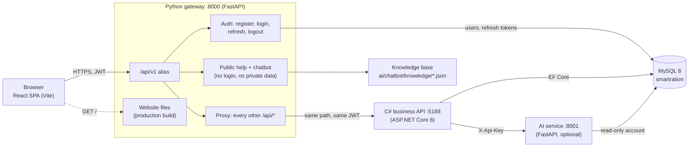
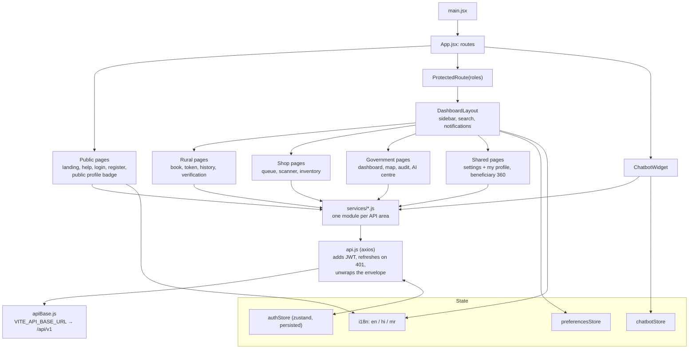
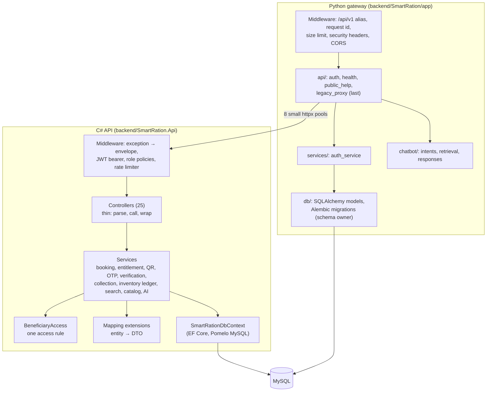
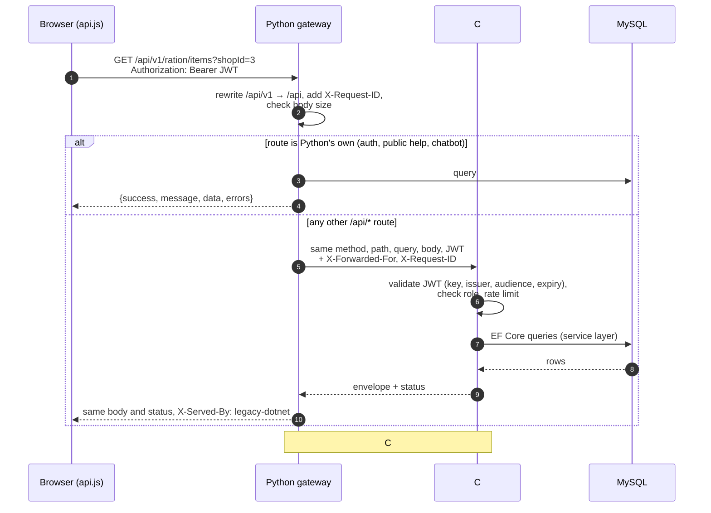
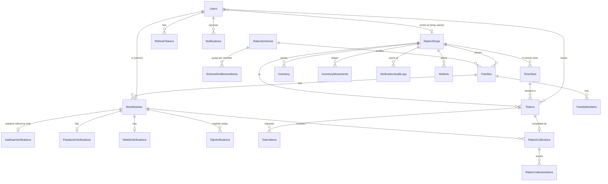
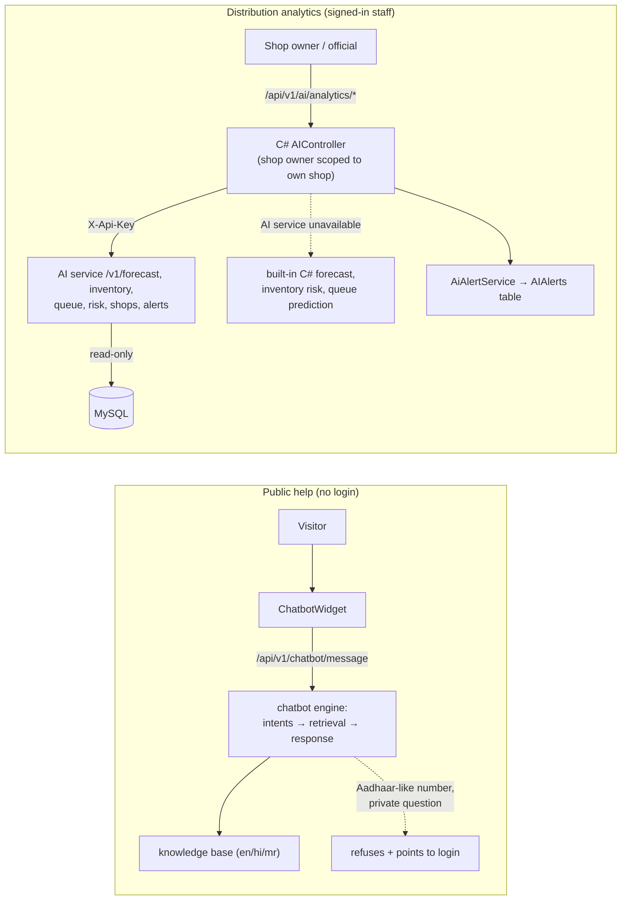
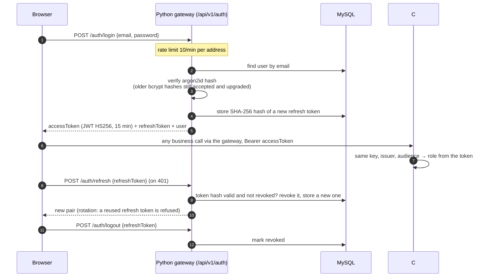
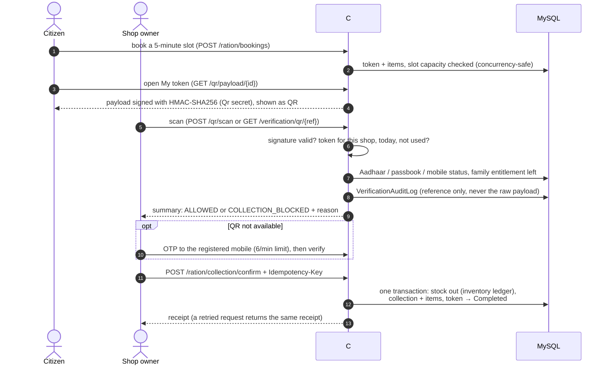
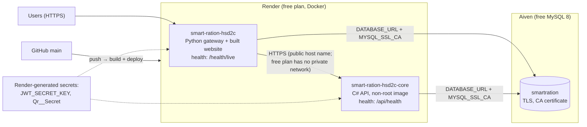
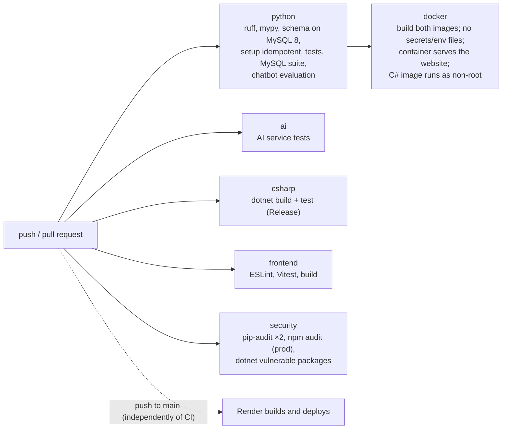

# Architecture diagrams

Ten diagrams of the system as it is built (checked against the code on 2026-09-26). They are
[Mermaid](https://mermaid.js.org/) text, so GitHub and VS Code (with a Mermaid preview extension)
render them, and a change to the system is a reviewable change to this file.

1. [System architecture](#1-system-architecture)
2. [Frontend architecture](#2-frontend-architecture)
3. [Backend architecture](#3-backend-architecture)
4. [API flow](#4-api-flow)
5. [Database relationships](#5-database-relationships)
6. [AI flow](#6-ai-flow)
7. [Authentication flow](#7-authentication-flow)
8. [QR verification flow](#8-qr-verification-flow)
9. [Deployment architecture](#9-deployment-architecture)
10. [CI/CD pipeline](#10-cicd-pipeline)

## 1. System architecture

The browser only ever talks to the Python gateway. The gateway answers sign-in, public help and the
chatbot itself and forwards every other `/api/*` call to the C# business API. Both backends use the same
MySQL database and the same JWT signing key.

## 2. Frontend architecture

## 3. Backend architecture

Controllers only translate HTTP; rules live in services; only services touch the database.

## 4. API flow

One authenticated call from the browser, for example `GET /api/v1/ration/items?shopId=3`.

## 5. Database relationships

The core tables (25 in total; Alembic revision `0001_initial` owns the schema). `Users` holds every role;
a citizen's `Beneficiaries` row links them to a `Families` row, which belongs to one shop and one scheme.

## 6. AI flow

Two separate AI parts. The public chatbot answers from a reviewed knowledge base and never sees private data.
The analytics come from the optional AI service; when it is down the C# API answers with its own simpler
calculations, so the dashboards keep working.

## 7. Authentication flow

## 8. QR verification flow

## 9. Deployment architecture

Render Blueprint (`render.yaml`, guide: [RENDER.md](../deployment/RENDER.md)). Synthetic-data demo; the AI
service is not deployed there (the dashboards use the C# fallback).

First start on an empty database: the C# API creates the schema and seeds synthetic data; the Python
service waits for it (`WAIT_FOR_LEGACY_API`), then verifies and adopts the schema (`RUN_DB_SETUP`).
Local alternative: `docker compose` / the four processes started by `sr.ps1 run`.

## 10. CI/CD pipeline

`.github/workflows/ci.yml`, on every push to `main` or `feature/**` and every pull request. Jobs run in
parallel; `docker` waits for `python`.

**Gap:** Render deploys every push to `main` whether or not CI passed (`render.yaml` sets no deploy
trigger). Setting the services to deploy only after checks pass (Render's "after CI checks pass" auto-deploy
option) closes it. NOT DONE: it can only be verified on a connected Render account.

Not in CI: the Playwright end-to-end tests and the HTTP load test, because they need the whole stack
running (`sr.ps1 e2e`, `sr.ps1 load`).
